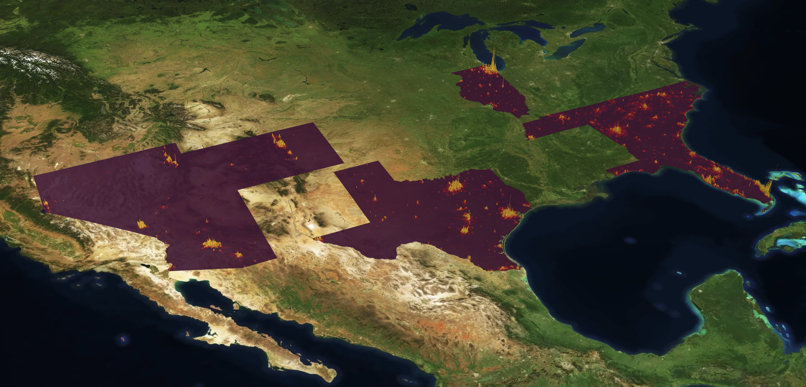
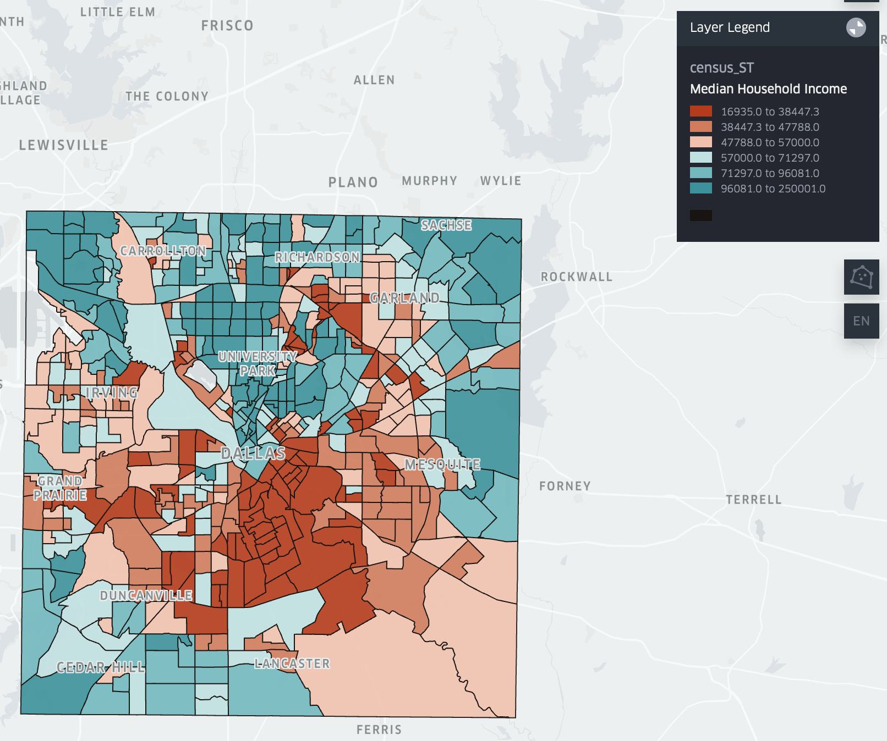
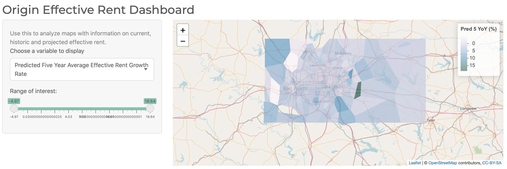

# Public Multifamily Data Visulization 

## Goals and Objectives 

Our goal is to create a suite of visualizations pertaining to predictive analytics for Multifamily Real Estate as well as key variables. To do this our objectives are as follows: 

* Leverage Kepler GL to allow for fast exploration of vast amounts of census data
* Create an R-Shiny Application that maps key multifamily variables: supply (number of properites), current effective rent, YoY effective rent and projected effective rent growth. 
* Provide clear explanation on each variable as well as an overview of methods used in creating prediction

## Background and Motivation

Real Estate Investment Trusts, (REITS), specifically those which focus on Multifamily properties, are one of the few financial institutions yet to widely adopt advances in geocomputation yet they simultaneously stand to benefit from such advances given the inherently spatial process of selecting assets whether they be for development or acquisition. Moreover, given the wide array of different neighborhoods within the United States it is often difficult for smaller firms to adequately understand the makeup of each area for which they may consider investing. Therefore, a better understanding of place via an all inclusive dashboard will help optimize deal flow. Moreover, an understanding of which areas will see the highest rent growth, arguably the most important metric for whether or not an investment is successful, allows for firms to narrow their scope leading to a more effective utilization of capital. 

## Data Sources and Scale

|                      Variable Name                     |                                                               Description                                                              |  Granularity |            Source            |
|:------------------------------------------------------:|:--------------------------------------------------------------------------------------------------------------------------------------:|:------------:|:----------------------------:|
| Tract ID                                               | The Unique Identifier of the Census Tract                                                                                              | Census Tract | 2019 ACS (Five Year Average) |
| County                                                 | The County of the Census Tract                                                                                                         | Census Tract | 2019 ACS (Five Year Average) |
| State                                                  | The State of the Census Tract                                                                                                          | Census Tract | 2019 ACS (Five Year Average) |
| Population                                             | Estimated Total Population                                                                                                             | Census Tract | 2019 ACS (Five Year Average) |
| Population Density                                     | Population divided by census tract area (in kilometers)                                                                                | Census Tract | 2019 ACS (Five Year Average) |
| Median Household Income                                | Median Household Income in the past 12 months                                                                                          | Census Tract | 2019 ACS (Five Year Average) |
| Income Growth Rate                                     | Growth Rate of the difference between 2019 Median Household Income and the 2018 Median Household Income (Both From 5 year average ACS) | Census Tract | 2019 ACS (Five Year Average) |
| Census Rent                                            | Median Gross Rent                                                                                                                      | Census Tract | 2019 ACS (Five Year Average) |
| Rent Affordability Ratio                               | Census rent times twelve divided by Median Household Income                                                                            | Census Tract | 2019 ACS (Five Year Average) |
| Renter Proportion                                      | Renter-occupied housing units / (Renter-occupied housing units + Owner-occupied housing units)                                         | Census Tract | 2019 ACS (Five Year Average) |
| Units Per Capita                                       | Total Renter-occupied housing units / Population                                                                                       | Census Tract | 2019 ACS (Five Year Average) |
| Mean Current Effective Rent                            | Weighted (by total units) Average Effective Rent for properties in a submarket (Point in Polygon) as of February 2021                  | Submarket    | MPF Research Inc             |
| Number of Properties                                   | Number of Multifamily Apartments Within A Submarket (Point in Polygon)                                                                 | Submarket    | MPF Research Inc             |
| Year over Year Effective Rent Growth Rate              | Growth Rate Between Weighted Average Submarket Effective Rent in February 2021 and February 2020                                       | Submarket    | MPF Research Inc             |
| Predicted Five Year Average Effective Rent Growth Rate | Projected Average Annual Effective Rent Growth from February 2021 to February 2026                                                     | Submarket    | MPF Research Inc             |

There are two spatial scales of interest here separated into two different visualizations to allow for more straightforward utilization. The fist spatial scale to consider would be census tracts as defined by the United States Census Bureau and the second are our proprietary submarkets which have been substantially altered for public use in the form they appear here. Data from census tracts is pulled from both the 2019 and 2018 Five Year Average American Community Survey (ACS). 

The ‘submarkets’ used here are a very early iteration of our own proprietary submarkets based on results from a spatially constrained multivariate k-medians clustering algorithm which took in the location of private multifamily properties as well as their attributes (Number of floors, Effective Rent, Occupancy and so fourth). We are not able to supply any form of property specific data here however, if it is of interest this data is provided by MPF Research. 

To generate the "Number of Properties’” variable for each submarket we used a point in polygon operation to count the number of total properties within each submarket. To protect private data we then added a random number to this result which functions to mask the actual result while keeping the results reasonable. To generate the “Mean Current Effective Rent” variable we used a points in polygon operation to calculate the average effective rent of each property in a submarket. Each property is weighted by its total number of units during this calculation and this is based of rental data from February 2021. Note that the “Year over Year Effective Rent Growth Rate” is based on the growth rate of the Mean Effective Rent (weighted as described before) from February 2021 to February 2020. Each of these variables are randomized by the addition of a random number once again in order to protect private data. The “Predicted Five Year Average Effective Rent Growth Rate” is the result of a proprietary time sires prediction algorithm which cannot be discussed in detail here. However, predictions are largely based on the historic weighted effective rent of each submarket. To protect these private predictions we reassigned predictions randomly between different polygons in a given market and then added a small random number. The value itself is the average predicted annual rent growth from February 2021 to February 2026.

## Methods Used 

Our methodology revolved around the two visualizations we wanted to create, one in Kepler.gl and one in ShinyApp. 

1. We first collected the data and cleaned the data for the visualizations. Predicitons were randomized given that they are based on a proprietary model. Not too much information can be said about this method as it would reveal private information. 

2. Then, we created the visualization for the Census data in Kepler.gl. With the Census data already cleaned we added the dataset to Kepler.gl. We included only data relevant to the discussion of properties. To prepare a final version of this visualization, we changed the basemap to Dark with no labels to highlight the census tract polygons. We styled the census tract polygons to a bright orange shade. Lastly, we modified the tool tip to include the following pieces of information: population, population density, median household income, income growth rate, population growth rate, census rent, rent affordability ratio, renter proportion, and units per capita. 

3. Lastly, we created the visualization for the Rent Prediction date in a Shiny app. 
 - To do this, we first created an account on Shinyapps.io which would allow us to store and run our final app on webpage. Using 'rsconnect' we were able to set the account information within RStudio. Instead of using an Rmarkdown we created an Shiny Web App which consisted of three main parts.
  - First, load the packages.
  - Secondly, we define UI for application. 
    + We started with setting the theme of the UI using one of the custom Bootstrap Sass themes. 
    + Then, we set the application title to Origin Effective Rent Dashboard. 
    + Nest, we created a sidebar panel with a dropdown menu and slider. The dropdown menu allows the user to choose from the following choices: Number of Properties, Mean Current Effective Rent, Year over Year Effective Rent Growth Rate, and Predicted Five Year Average Effective Rent Growth Rate. 
    + Within the UI, the choropleth map is shown to the right of the sidebar panel.
  - Thirdly, we define the server logic required to draw the map. 
    + Modify the data displayed using the input choice 
    + Modify the legend using the input choice 
    + Create the desired map  

## Results

#### Using Kepler.gl
For the census explorer map hosted in Kepler.gl please navigate to this [link](https://kepler.gl/demo/map?mapUrl=https://dl.dropboxusercontent.com/s/2o334e8zxyzbyp0/keplergl_2q1fwt.json)
To add a filter:
 - Select Filters from the left navigation bar and select Add a Filter.
 - Choose a dataset, and then a field on which to filter your data. Filter values are defined by field data type (number, string, timestamp, etc.). 
 - The filter is applied to your map as soon as you specify the field and value.
To change the Base map:
 - Select BaseMap from the right navigation bar. 
 - Open the base map style drop down menu to change map color scheme and imagery. Options include:
    + Dark: dark base map with light-colored text.
    + Light: light base map with dark-colored text.
To modify the tooltip (the displayed metrics when hovering over a data point):
-Choose which fields are displayed from the tooltip config menu.

#### Using RShiny 

For the submarket effective rent map hosted in RShiny please navigate to this [link](https://ryan-brown.shinyapps.io/OriginViz/?_ga=2.82723859.406696026.1622923111-1591203086.1622923111)
To choose a variable to display:
- Select the current variable to trigger a dropdown menu from which you can change the variable of interest. 
To modify the range:
- Click and drag the two buttons on the slider to select the range of interest.

## Main Highlights

These dashboards should function to drastically reduce time spent underwriting different properties given all census data for each tract can be found in a single location and the same can be said for submarket predictions. That being said each dashboard is built to enable quick exploratory data analysis of variables pertinent to Multifamily real estate. To begin consider the Kepler dashboard. While it begins with many tracts one can add filters for specific counties they are interested in and the produce choropleth maps of their variable of interest for the number of bins they desire. They can then export an image of the results to include in a presentation or save for later analysis. The Shiny dashboard is quite useful given its agile structure and ability to enable quick identification of high growth locations via the sliders this in turn enables analysts to identify interesting submarkets within four clicks! 

## Limitations, Future Work, and Conclusion

Both Kepler.gl and RShiny have their limitations. Kepler.gl handles large datasets well and allows for the user to pick and choose how they want to display or modify the data. However, Kepler.gl is not intuitive. It comes with a learning curve making it hard for just anyone to interpret the maps right away. In contrast, RShiny's dashboard is easy to follow and allows the user to modify the data displayed in a more intuitive way. With this in mind, RShiny cannot handle data at the same scale as Kepler.gl. 
In the future, we would like to create one dashboard to hold all of the information provided today. Ideally, this dashboard would have a user interface similar to the RShiny app we created but with the backend capabilities of Kepler.gl. Both maps provide a great way to explore the data listed in regard to the real estate. 
Overall, we were able to successfully create the suite of visualizations for predictive analytics for Multifamily Real Estate. These visualizations leverage Kepler GL to allow for fast exploration of vast amounts of census data and R-Shiny Application that maps key multifamily variables.

This project is licensed under the MIT License - see the [LICENSE.md](LICENSE.md) file for details
